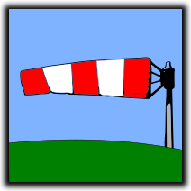

# Windsock

 

Connect IQ data field which displays wind direction relative to the direction you're moving. Designed for the Edge head units.

Requires Connect IQ 3.2 and higher and works* on following devices:
 
  - Edge 530
  - Edge 830
  - Edge 1030
  - Edge 1030+

Data field displays direction the wind is coming at you and wind speed (units depend on your device settings).

Arrow will change the color from green to red depending on the wind strength and direction, i.e. tailwind is always good(green) and light headwind is not a big deal either (green), but stronger headwind will be shown in orange or red.

The windsock data field uses Garmin provided weather data, make sure it is enabled in the Garmin Connect Mobile for your Edge device.

-----
\* should work, at least
